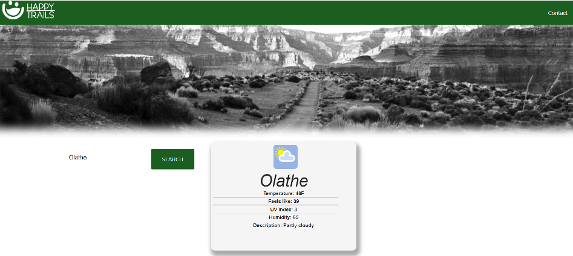
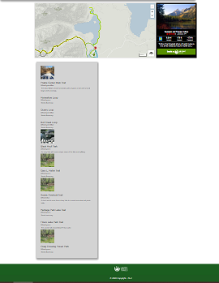

# Happy Trails
____________________________________________________________________
## Group 1 Collaborators
    - Victoria Rouser
    - Donovan Chavez
    - Aman Aujla
    - Kendra Hallam
____________________________________________________________________
## User Story:

AS AN enthusiastic traveler

I WANT to enter the zip code on Happy Trails

SO THAT I can check out local trails and how long it will take to finish.

____________________________________________________________________
## Criteria:

GIVEN a hiking trails website with form inputs

WHEN I search for a city/zip code

THEN I am presented with current conditions & trail locations

WHEN I view trails

THEN I am presented with the trail name, mileage, & elevation

WHEN I view the trail

THEN I am presented with a color that indicates whether the challenge of the hike easy, moderate, or difficult.

WHEN I click on a city in the search history

THEN I am again presented with current conditions & trail locations

WHEN I open the happy trails app

THEN I am presented with the last searched conditions and trails
____________________________________________________________________
## Resources:
- Materialize CSS: https://materializecss.com/
- W3Schools
____________________________________________________________________
## API Resources
- Hiking Project: hikingproject.com/
- Weather Stack: Weatherstack.com
____________________________________________________________________
<i>Challenges - Assigning the correct task for group and pulling the up to date files from GITHUB. </i>
____________________________________________________________________
## Mock-up:

____________________________________________________________________
## Website: 

